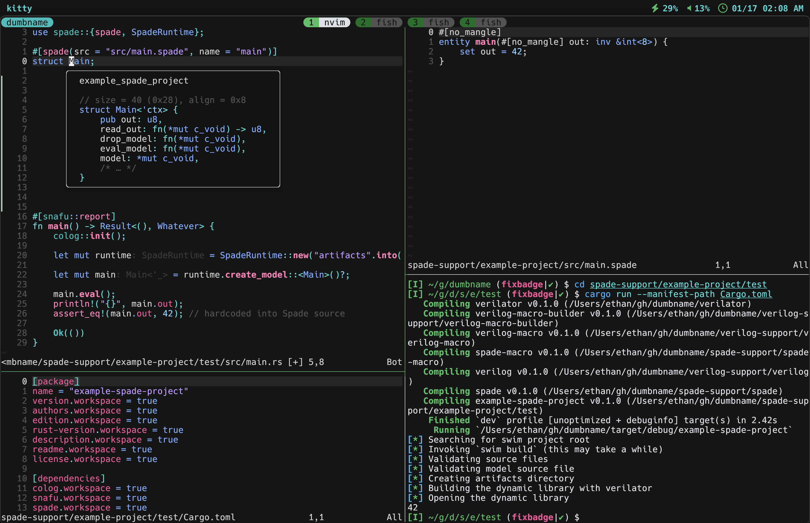

# marlin 🐟

**[Read the documentation](https://ethanuppal.com/marlin)** | **[Read the API reference](https://docs.rs/marlin/latest/marlin)**

Marlin is a really powerful library (and API) that lets you "import" hardware
modules into Rust (or Rust functions into hardware modules!). 

No precompilation step and manual updates with `verilator` harnesses; no 
Makefiles and quirky decorators with `cocotb` testbenches. You're writing a regular Rust crate here.

Add this library to your `Cargo.toml` like any other library. Use hardware
modules as `struct`s like any other Rust `struct`. Hook them up to `tokio` or
`serde` even. `cargo test` as hard as you want.

Marlin works out of the box on macOS and Linux (verified under continuous integration).

> [!NOTE]
> The above screenshot is pre-0.1.0, so it's a bit out of date -- Marlin has
> improved a lot since then!

## 🔥 Motivation

Why does hardware testing suck? Consider the ways we have to test
(System)Verilog:

- **Test natively**: Verilog is already a terrible enough language, and writing
  tests *in* Verilog is really annoying.
- **Use verilator harnesses**: You have to first run Verilator to get the right
  headers, recompile manually every time, deal with raw pointers and C++, etc.
- **Use cocotb**: You have to use Makefiles or write your own Python runner, 
  performance isn't the greatest, you get no LSP support for ports, etc.

The problem gets worse with custom HDLs, so they've come up with some creative
solutions:

- [Calyx](https://calyxir.org): the canonical way of testing Calyx code is to
  read from JSON files representing byte arrays and write to JSON files
  representing byte arrays.
- [Spade](https://spade-lang.org): `verilator` integration involves [absurd
  macro magic](https://docs.spade-lang.org/simulation.html#verilator) and [using
  `cocotb`](https://docs.spade-lang.org/simulation.html#cocotb) requires putting the design-under-test in a code comment.
- [Veryl](https://veryl-lang.org): you literally [write inline Verilog or Python](https://doc.veryl-lang.org/book/05_language_reference/13_integrated_test.html). Yes, inside Veryl code.

Still, a lot of these are less than optimal.

## ✨ Features

- 🚀 Minimal overhead over directly using `verilator`
- 🔌 Works completely drop-in in your existing projects
- 🪙 Declarative API for usability + Dynamic API for programmability
- 🔄 DPI support in Rust: call Rust functions from (System)Verilog
- 🦀 Rust. Did I say Rust?

## ⚡️ Requirements

- [Rust](https://rustup.rs), 2021 edition
- [`verilator`](https://verilator.org/guide/latest/install.html), 5.025 or later
   - `make`, e.g. [GNU Make](https://www.gnu.org/software/make/)

## 📦 Install

Marlin is on [crates.io], so just use `cargo add --dev marlin` to add Marlin as a
dependency for your tests (`dev-dependencies`).

## ❓ How it works

I'll write more on this once I get further in the development process.
The TLDR is procedural macros + `dlopen`.

### Hardware simulation tools are slow! How does Marlin deal with that?

Simulation tools take an _absurd_ amount of time to run.
For example, when you use Marlin in a Spade project, it calls out to:

- `swim build`, which recompiles the entire Spade compiler from source
- `verilator`, which compiles and links C++ code

Marlin automatically running them with all the right flags and arguments
--- and it caches and only invokes them when needed.

## 🌎 Related

- [verilated-rs](https://github.com/djg/verilated-rs) is a super cool library
  that uses a build script to statically link in verilated bindings, but is
  unmaintained for years as of writing this.

## 🔒 License & Legal

Marlin is licensed under the Mozilla Public License 2.0. This license is
similar to the Lesser GNU Public License, except that the copyleft applies only
to the source code of this library, not any library that uses it. That means you
can statically or dynamically link with unfree code (see
<https://www.mozilla.org/en-US/MPL/2.0/FAQ/#virality>).

I use [`cargo-deny`](https://github.com/EmbarkStudios/cargo-deny) (see the
[`deny.toml`](./deny.toml) to ensure no licensing violations occur. I also check
this on CI to prevent merging any new dependencies or dependency updates that
introduce incompatible licenses.

[crates.io]: https://crates.io/crates/marlin
